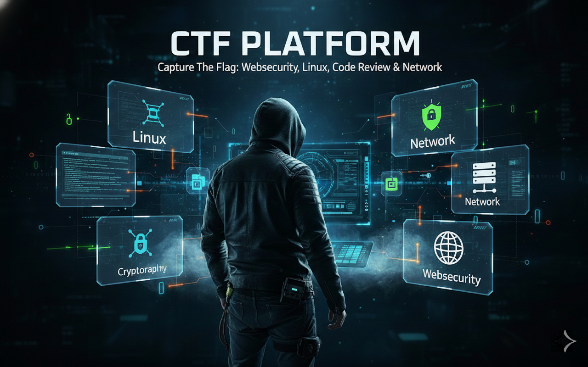

# 🎯 CYBERSKILLS LAB - Plataforma de Treinamento em CyberSegurança

<p align="center">
  
</p>

**[English](README-EN.md) | [Português](#português)**

---

<p align="center">
  
  
  
  
  
</p>

<p align="center">
  
  
  
  
</p>

## 📖 Sobre

**CYBERSKILLS LAB** é uma plataforma open-source de laboratórios interativos para treinamento em **CyberSegurança, Pentest, Linux e Capture The Flag (CTF)** voltada para o público geral que estuda cibersegurança e Linux.

### ✨ Principais Recursos

- ✅ **Execução Local**: Roda diretamente na sua máquina via Docker
- ✅ **Timer Dinâmico**: Cada lab tem duração específica (60-120 min)
- ✅ **Botão Encerrar**: Encerre a sessão a qualquer momento
- ✅ **Auto-Destruição**: Containers são removidos automaticamente
- ✅ **Terminal Web Integrado**: Terminal xterm.js no navegador
- ✅ **Interface Web**: Acesso via navegador (porta 5000)
- ✅ **Sistema de Usuários**: Cada pessoa tem seu próprio perfil
- ✅ **Feedback Visual**: Indicadores visuais de acerto/erro
- ✅ **Scoreboard**: Ranking com top 20 jogadores
- ✅ **Desafio Final Secreto**: Desbloqueado ao completar todos os labs

## 🎮 Cenários Disponíveis

| Cenário | Desafios | Pontos | Duração | Dificuldade |
|---------|----------|--------|---------|-------------|
| 🐧 Linux Básico | 14 | 280 | 60 min | Fácil |
| 🔐 Criptografia | 8 | 190 | 60 min | Fácil |
| 🌐 Web Security | 3 | 150 | 90 min | Médio |
| 🌐 Network | 3 | 120 | 90 min | Médio |
| 💻 Code Review | 6 | 150 | 75 min | Médio |
| 🎯 Pentest | 5 | 200 | 120 min | Difícil |
| 🏆 Desafio Final | 1 | 100 | 10 min | Lendário |

**Total: 40 desafios | 1190 pontos**

## 🚀 Instalação Rápida

### Pré-requisitos

- **Docker** instalado ([Guia de instalação](https://docs.docker.com/get-docker/))
- **Linux** (Debian/Ubuntu recomendado)
- **Python 3.8+**
- **4GB RAM** mínimo
- **10GB** espaço em disco

### Passo 1: Instalar Docker

```bash
curl -fsSL https://get.docker.com | sudo bash
```

### Passo 2: Clonar o Repositório

```bash
git clone https://github.com/Jhow-Magnum/cyberskills-lab.git
cd cyberskills-lab
```

### Passo 3: Executar Instalação

```bash
bash install.sh
```

### Passo 4: Iniciar Plataforma

```bash
bash start.sh
```

Acesse: **http://localhost:5000**

## 📁 Estrutura do Projeto

```
cyberskills-lab/
├── install.sh              # Script de instalação
├── start.sh                # Inicia plataforma
├── stop.sh                 # Para plataforma
├── build-all.sh            # Constrói todas as imagens Docker
├── ctf-simple.py           # Backend Flask com WebSocket
├── web.html                # Interface web principal
├── requirements.txt        # Dependências Python
├── ctf_scores.db           # Banco de dados SQLite
├── LICENSE                 # Licença MIT
├── CONTRIBUTING.md         # Guia de contribuição
├── MAPA_FLAGS.md           # Mapa de todas as flags
├── repositories/           # Repositório YAML dos labs
│   └── ctf-senai/
│       ├── index.yaml      # Índice dos labs
│       └── labs/           # Definições YAML de cada lab
│           ├── linux-basic/
│           ├── crypto/
│           ├── web-security/
│           ├── network/
│           ├── code-review/
│           └── pentest/
└── scenarios/              # Dockerfiles dos cenários
    ├── linux-basic/
    ├── crypto/
    ├── web-security/
    ├── network/
    ├── code-review/
    └── pentest/
```

## 🛠️ Comandos Úteis

```bash
bash start.sh       # Iniciar plataforma
bash stop.sh        # Parar plataforma
bash install.sh     # Reinstalar dependências
bash build-all.sh   # Reconstruir imagens Docker
```

## 🔧 Troubleshooting

### Erro: Porta 5000 em uso

```bash
# Encontre o processo
lsof -ti:5000

# Mate o processo
lsof -ti:5000 | xargs kill -9

# Ou use o script
bash stop.sh
```

### Container não inicia

```bash
# Verifique se as imagens existem
docker images | grep ctf-senai

# Reconstrua se necessário
bash build-all.sh
```

### Limpar containers parados

```bash
# Remove todos os containers CTF
docker ps -a | grep ctf- | awk '{print $1}' | xargs docker rm -f

# Ou use o script
bash stop.sh
```

### Erro de permissão no Docker

```bash
# Adicione seu usuário ao grupo docker
sudo usermod -aG docker $USER

# Faça logout e login novamente
```

### Banco de dados corrompido

```bash
# Backup do banco
cp ctf_scores.db ctf_scores.db.backup

# Remove e reinicia
rm ctf_scores.db
python3 ctf-simple.py
```

## 🛠️ Stack Tecnológica

- **Backend**: Python 3.8+ com Flask
- **Containerização**: Docker
- **Terminal**: xterm.js com WebSocket
- **Banco de Dados**: SQLite
- **Frontend**: JavaScript Vanilla + CSS3

## 🤝 Contribuindo

> 💡 **Contribuições e sugestões de melhorias são super bem-vindas!**
> 
> Este é um projeto em constante evolução e sua ajuda é fundamental para torná-lo ainda melhor.
> Seja reportando bugs, sugerindo novos labs, melhorando a documentação ou contribuindo com código.

Contribuições são bem-vindas! Veja [CONTRIBUTING.md](CONTRIBUTING.md) para detalhes.

### Como Contribuir

1. Fork o projeto
2. Crie uma branch (`git checkout -b feature/NovoLab`)
3. Commit suas mudanças (`git commit -m 'feat: adiciona novo lab'`)
4. Push para a branch (`git push origin feature/NovoLab`)
5. Abra um Pull Request

### Ideias de Contribuição

- 🆕 Novos labs (forense, malware, cloud security)
- 🐛 Correção de bugs
- 📚 Melhorias na documentação
- 🎨 Melhorias na interface
- 🔧 Novas funcionalidades

## 🌟 Roadmap

- [ ] Sistema de badges e conquistas
- [ ] Modo competição em tempo real
- [ ] Labs de forense digital
- [ ] Labs de malware analysis
- [ ] Labs de cloud security (AWS/Azure)
- [ ] Integração com CTFd
- [ ] API pública
- [ ] Dashboard de analytics
- [ ] Suporte a múltiplos idiomas

## 📊 Estatísticas

- **6 Labs** principais
- **40 Desafios** totais
- **1190 Pontos** máximos
- **6 Categorias** de segurança
- **100% Open Source**

## 📞 Suporte e Comunidade

- 🐛 **Issues**: [GitHub Issues](https://github.com/Jhow-Magnum/cyberskills-lab/issues)
- 💬 **Discussões**: [GitHub Discussions](https://github.com/Jhow-Magnum/cyberskills-lab/discussions)
- 📧 **Email**: contato@exemplo.com
- 📖 **Wiki**: [GitHub Wiki](https://github.com/Jhow-Magnum/cyberskills-lab/wiki)

## 👥 Criador & Comunidade

### 🚀 Fundador

**Jhow Magnum** - *Criador e Desenvolvedor Principal*

- 🐙 GitHub: [@Jhow-Magnum](https://github.com/Jhow-Magnum)
- 💼 LinkedIn: [Jhow Magnum](https://www.linkedin.com/in/jhowmagnum/)

---

### 🤝 Projeto Comunitário

Este projeto é **aberto para contribuições** da comunidade de cibersegurança!

**Aceitamos:**
- 🆕 Novos labs e desafios
- 🐛 Correções de bugs e melhorias
- 📚 Melhorias na documentação
- 🌍 Traduções
- 💡 Sugestões de funcionalidades

**Quer contribuir?** Veja nosso [Guia de Contribuição](CONTRIBUTING.md)

---

### 🌟 Contribuidores

Obrigado a todos os contribuidores que ajudam a tornar o CYBERSKILLS LAB melhor!

<!-- ALL-CONTRIBUTORS-LIST:START -->
<!-- Esta seção é gerada automaticamente -->
<!-- ALL-CONTRIBUTORS-LIST:END -->

## 🙏 Agradecimentos

- Comunidade de CyberSegurança
- Contribuidores do projeto
- Comunidade Linux e Open Source

## ⭐ Star History

Se este projeto foi útil para você, considere dar uma ⭐!

## 📄 Licença

MIT License - veja [LICENSE](LICENSE) para detalhes.

---

<p align="center">
  Feito com ❤️ para a comunidade de CyberSegurança
</p>

<p align="center">
  <strong>Versão 1.0.0</strong> | 2025
</p>
